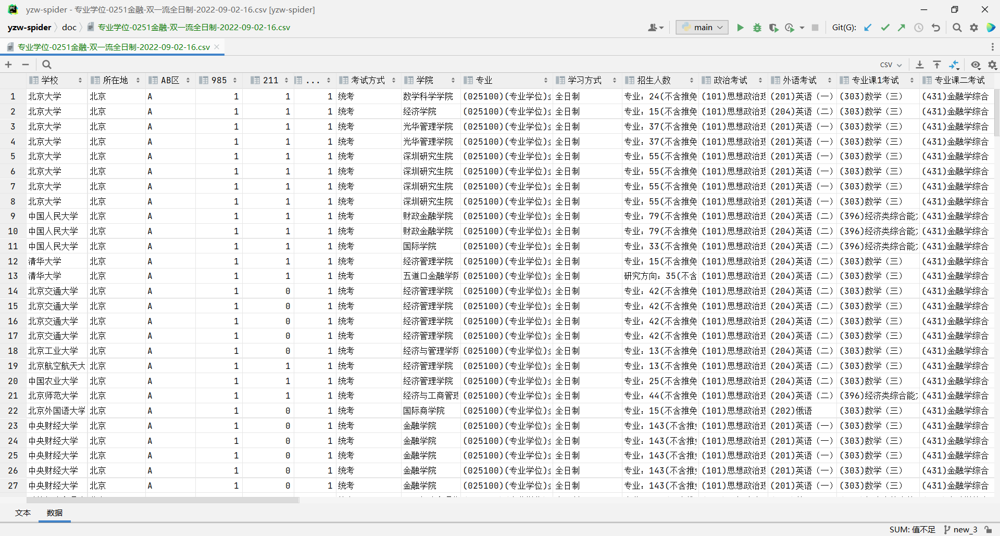

<div align=center>


# 研招网专业目录下载2022 -YanX


*研招网专业目录下载2022-YanX* 是可用的研招网招生专业目录下载程序。

基于PyQT的GUI操作界面，不用敲任何命令直接下载使用，让零代码基础的人也能快速使用。

常说考研选择大于努力，我希望这个程序能够帮助更多的考研人做更好的选择！


</div>


---

### 下载：

- 龟速下载:[GitHub Releases](https://github.com/xx025/YanX/releases/)
- 高速下载:[蓝奏云](https://wwu.lanzouv.com/ihzfD0aqva7a) 密码:c82p

## 使用演示:

- 注意：文件导出到桌面，导出文件为CSV格式，这个文件可用Excel打开（WPS亦可）

[](https://www.bilibili.com/video/BV1SP4y1f7HG)

## 程序功能：

1. 选择门类类别（专业学位或某个学术学位）、选择学科类别或专业领域
2. 设置筛选条件，
    1. 学习方式：全日制或非全日制
    2. 院校建设计划，支持只选择211、985或双一流等重点院校
    3. 考研地区，可以选择A类地区或B类地区
3. 按条件下载所有院校的专业招生信息，包含院校地区、建设计划
4. 导出文件到CSV
   导出文件示例
    - [专业学位-0251金融-双一流全日制](doc/专业学位-0251金融-双一流全日制-2022-09-02-16.csv)
    - 

---

## 环境

Python 3.8.5

## 数据库

SQLite

数据库文件位于[db/database.db](db/database.db)

## 打包

### 打包步骤

[](https://www.bilibili.com/video/BV1Ce4y1Z7Nq/)

```
venv\Scripts\activate.bat
pyinstaller -F -w -i img/ico.ico main.py
```

---

## 项目声明

项目声明：

1. 本软件只供学习交流使用，勿作为商业用途
2. 对使用本软件造成的任何影响，概不负责
