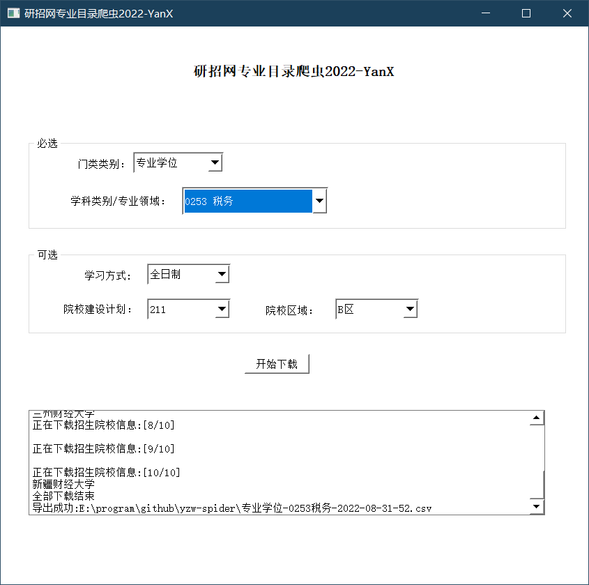
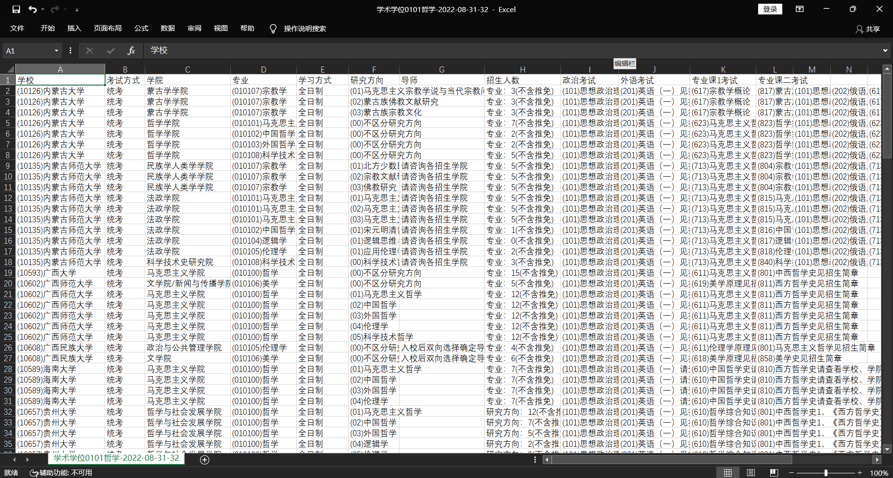

<div align=center>


# 研招网院校专业爬虫2022 -YanX

研招网院校专业爬虫2022-YanX是可用的研招网招生专业目录爬虫程序。

基于PyQT的GUI操作界面，不用敲任何命令直接下载使用，让零代码基础的人也能快速使用。

都说考研选择大于努力，我希望能够帮助更多的考研人做更好的选择！

</div>

## 使用



## 爬虫功能：

1. 选择门类类别（专业学位或某个学术学位）、选择学科类别或专业领域，这决定了爬虫的方向
2. 设置筛选条件，
    1. 学习方式：全日制或非全日制
    2. 院校建设计划，支持只选择211、985或双一流等重点院校
    3. 考研地区，可以选择A类地区或B类地区
3. 导出文件到CSV
   导出文件示例
   

---

## 环境

Python 3.8.5

## 数据库

SQLite

数据库文件位于`db/database.db`

## 打包


```
pyinstaller -D -w -i img/ico.ico main.py
```


