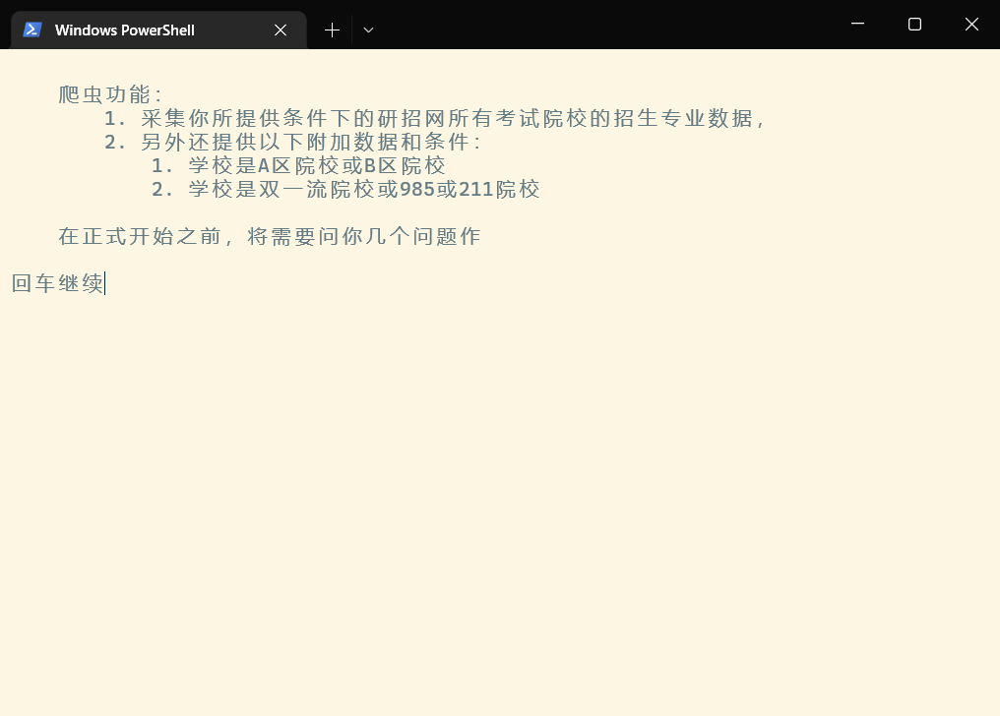
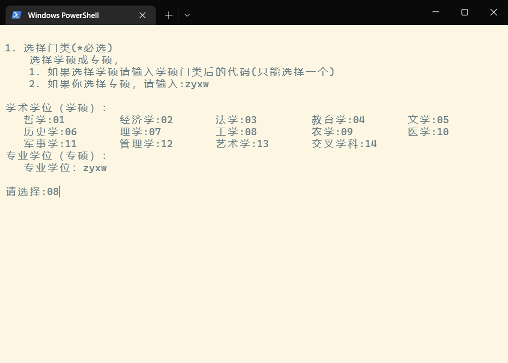
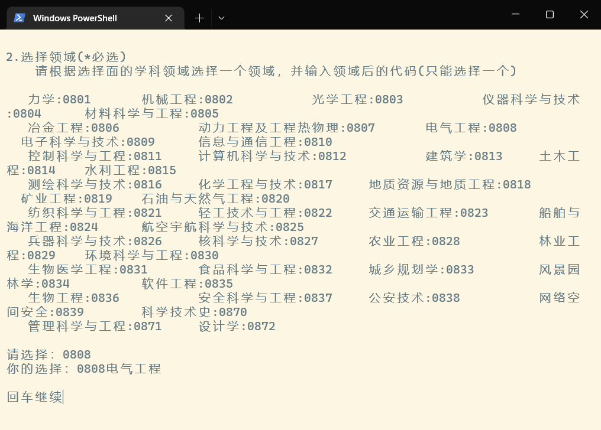
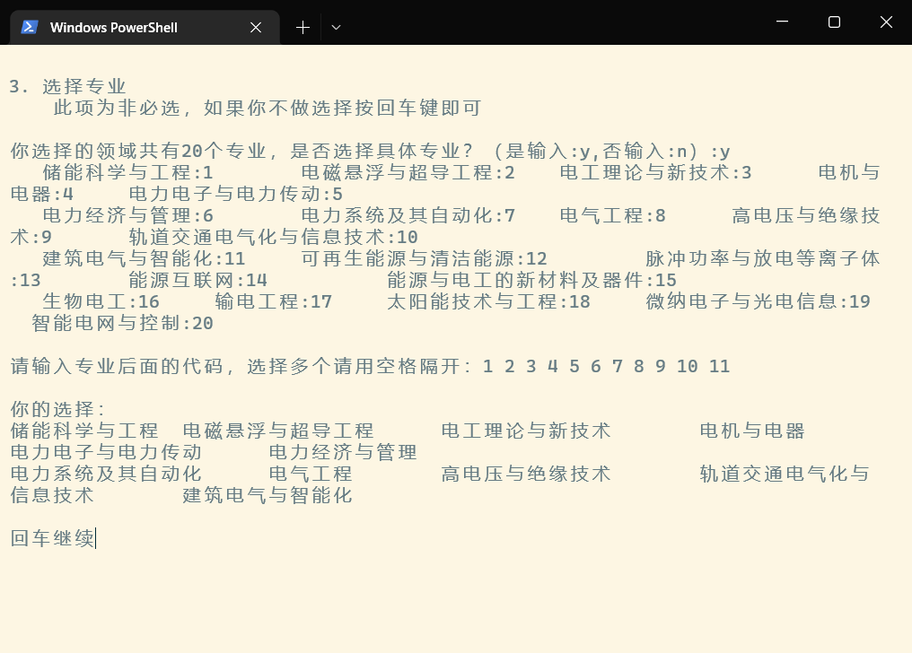
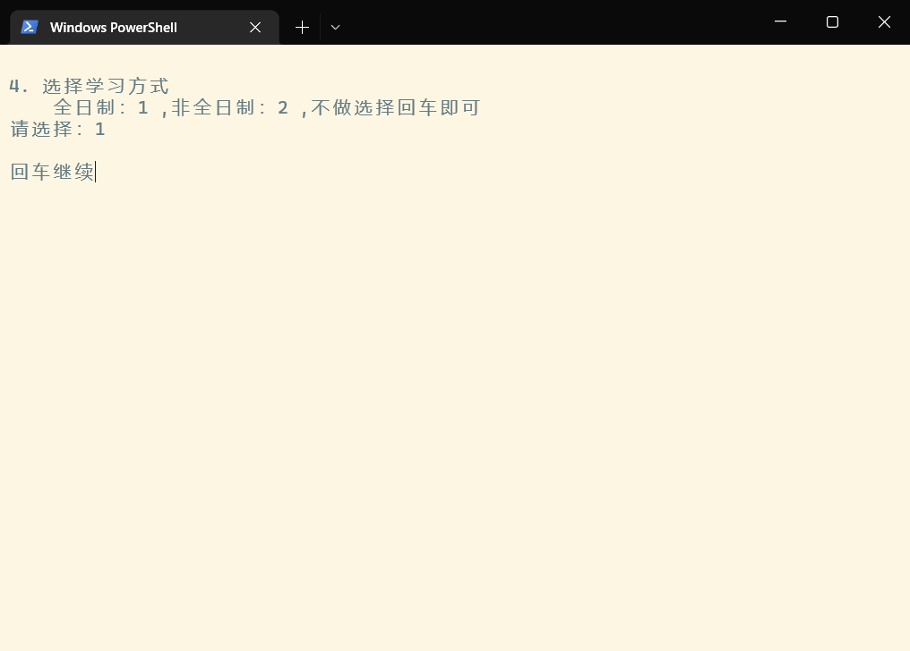
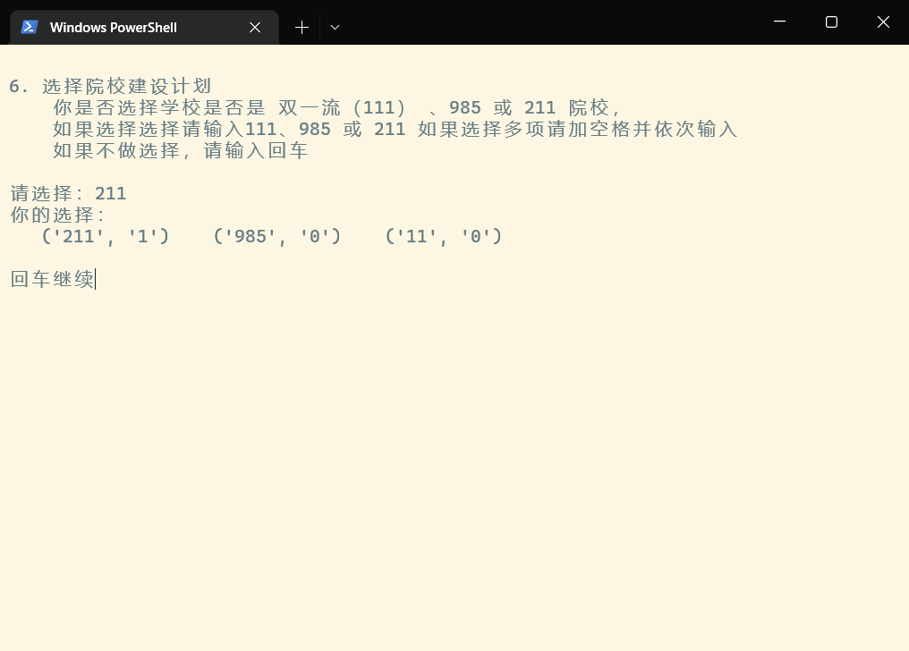
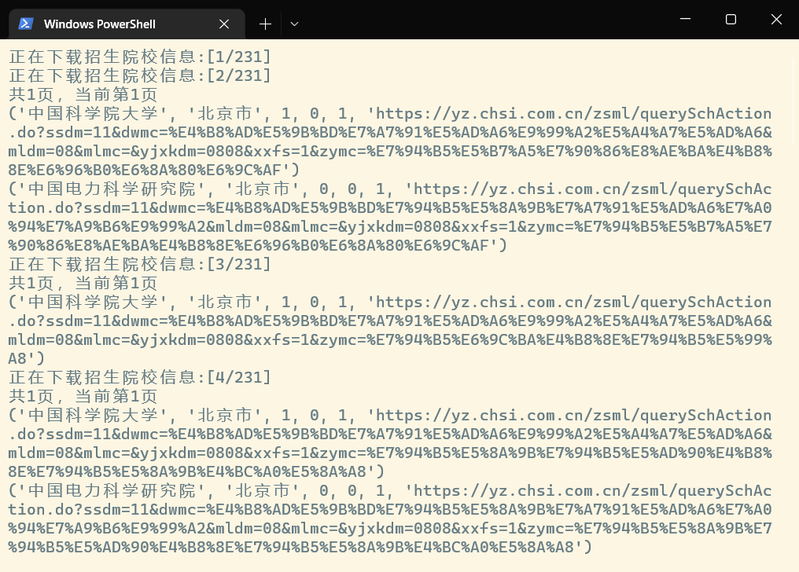

# 研招网院校专业爬虫2022

## 爬虫功能：

1. 采集你所提供条件下的研招网所有考试院校的招生专业数据，
2. 另外还提供以下附加数据和条件：
    1. 学校是A区院校或B区院校
    2. 学校是双一流院校或985或211院校


### 数据库
   Sqlite: db/database.db


## 使用
进入项目目录 运行下面的命令
```text
venv\Scripts\python.exe main.py
```














