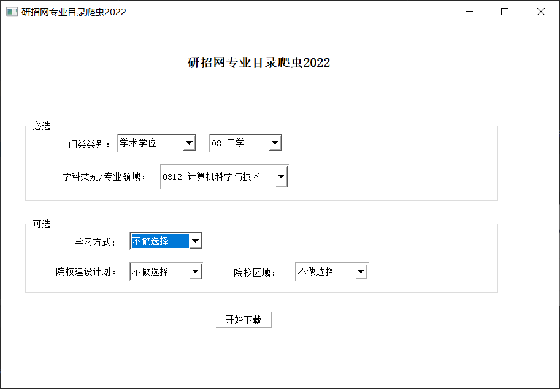

# 研招网院校专业爬虫2022 -YanX


研招网院校专业爬虫2022-YanX是目前唯一可用的研招网招生专业目录图像化爬虫，基于PyQT的GUI操作界面让零代码基础的人也能快速使用。


## 使用

进入项目目录 运行下面的命令

```text
venv\Scripts\python.exe main2.py
```



## 爬虫功能：

1. 采集你所提供条件下的研招网所有考试院校的招生专业数据，
2. 另外还提供以下附加数据和条件：
    1. 学校是A区院校或B区院校
    2. 学校是双一流院校或985或211院校

### 数据库

Sqlite: db/database.db


