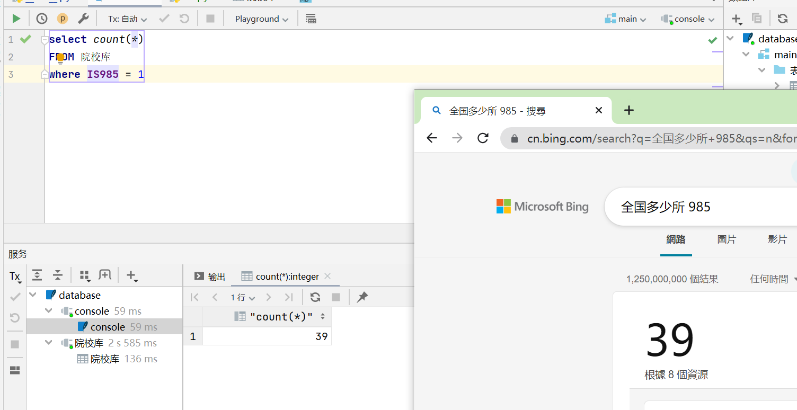
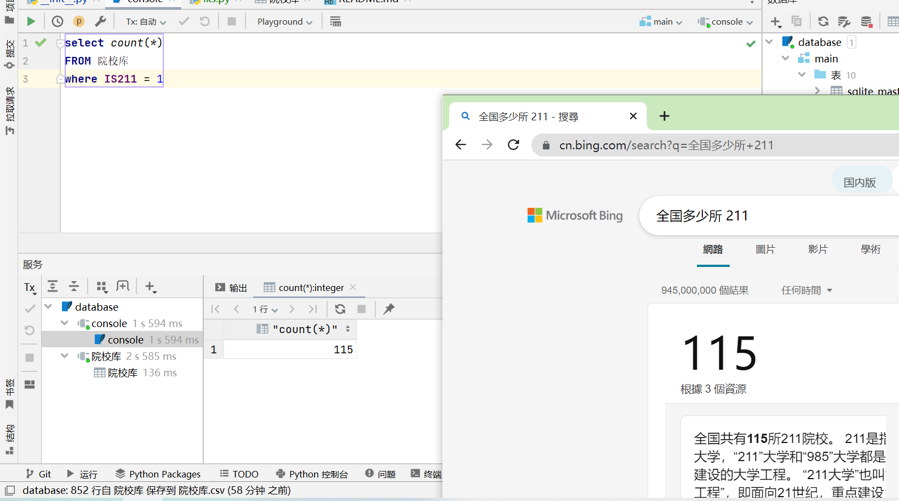

# AB类地区和985、211院校目录

## 权威参考资料
- A、B区：http://www.moe.gov.cn/jyb_xwfb/gzdt_gzdt/s5987/202203/W020220311583072811871.pdf
- 211工程名单：http://www.moe.gov.cn/srcsite/A22/s7065/200512/t20051223_82762.html
- 985工程名单：http://www.moe.gov.cn/srcsite/A22/s7065/200612/t20061206_128833.html
- 双一流名单：http://www.moe.gov.cn/s78/A22/A22_ztzl/ztzl_tjsylpt/sylpt_jsgx/201712/t20171206_320667.html
    > 数据库院校数据来源：https://yz.chsi.com.cn/sch/search.do?ylgx=1

## 地区
### A类地区

| 1| 2| 3|4 | 5| 6|7 | 
| :--- |:--- |:--- |:--- |:--- |:--- |:--- |
|北京|天津|河北|河南|山西|辽宁|吉林|
|黑龙江|上海|江苏|浙江|安徽|福建|江西|
|山东|湖北|湖南|广东|四川|重庆|陕西|

### B类地区

| 1| 2| 3|4 | 5| 6|7 | 
| :--- |:--- |:--- |:--- |:--- |:--- |:--- |
|内蒙古|海南|广西|贵州|云南|西藏|甘肃|
|青海|宁夏|新疆|

## 双一流、985和211院校

### 整理数据
其中有一些学校名字和参考资料上有些差别做了些如下改动：

    改动：
        国防科学技术大学 --> 国防科技大学
        中国石油大学 --> 中国石油大学(北京),中国石油大学(华东)
        第二军医大学 --> 海军军医大学
        中国地质大学 --> 中国地质大学(武汉),中国地质大学(北京)
        第四军医大学 --> 空军军医大学
        华北电力大学---> 华北电力大学,华北电力大学(保定)

    211 院校供计 115 所
    985 院校共计 39 所
    即使如此可能仍然有错误，如有请指出
### 双一流院校

| 1| 2| 3|4 | 5| 6|7 | 
| :--- |:--- |:--- |:--- |:--- |:--- |:--- |
|北京大学|中国人民大学|清华大学|北京交通大学|北京工业大学|北京航空航天大学|北京理工大学|
|北京科技大学|北京化工大学|北京邮电大学|中国农业大学|北京林业大学|北京协和医学院|北京中医药大学|
|北京师范大学|首都师范大学|北京外国语大学|中国传媒大学|中央财经大学|对外经济贸易大学|外交学院|
|中国人民公安大学|北京体育大学|中央音乐学院|中国音乐学院|中央美术学院|中央戏剧学院|中央民族大学|
|中国政法大学|华北电力大学|南开大学|天津大学|天津工业大学|天津医科大学|天津中医药大学|
|华北电力大学(保定)|河北工业大学|山西大学|太原理工大学|内蒙古大学|辽宁大学|大连理工大学|
|东北大学|大连海事大学|吉林大学|延边大学|东北师范大学|哈尔滨工业大学|哈尔滨工程大学|
|东北农业大学|东北林业大学|复旦大学|同济大学|上海交通大学|华东理工大学|东华大学|
|上海海洋大学|上海中医药大学|华东师范大学|上海外国语大学|上海财经大学|上海体育学院|上海音乐学院|
|上海大学|南京大学|苏州大学|东南大学|南京航空航天大学|南京理工大学|中国矿业大学|
|南京邮电大学|河海大学|江南大学|南京林业大学|南京信息工程大学|南京农业大学|南京医科大学|
|南京中医药大学|中国药科大学|南京师范大学|浙江大学|中国美术学院|安徽大学|中国科学技术大学|
|合肥工业大学|厦门大学|福州大学|南昌大学|山东大学|中国海洋大学|中国石油大学(华东)|
|郑州大学|河南大学|武汉大学|华中科技大学|中国地质大学(武汉)|武汉理工大学|华中农业大学|
|华中师范大学|中南财经政法大学|湘潭大学|湖南大学|中南大学|湖南师范大学|中山大学|
|暨南大学|华南理工大学|华南农业大学|广州医科大学|广州中医药大学|华南师范大学|海南大学|
|广西大学|四川大学|重庆大学|西南交通大学|电子科技大学|西南石油大学|成都理工大学|
|四川农业大学|成都中医药大学|西南大学|西南财经大学|贵州大学|云南大学|西藏大学|
|西北大学|西安交通大学|西北工业大学|西安电子科技大学|长安大学|西北农林科技大学|陕西师范大学|
|兰州大学|青海大学|宁夏大学|新疆大学|石河子大学|中国矿业大学(北京)|中国石油大学(北京)|
|中国地质大学(北京)|宁波大学|南方科技大学|上海科技大学|中国科学院大学|国防科技大学|海军军医大学|
|空军军医大学|

### 211计划院校
| 1| 2| 3|4 | 5| 6|7 | 
| :--- |:--- |:--- |:--- |:--- |:--- |:--- |
|北京大学|中国人民大学|清华大学|北京交通大学|北京工业大学|北京航空航天大学|北京理工大学|
|北京科技大学|北京化工大学|北京邮电大学|中国农业大学|北京林业大学|北京中医药大学|北京师范大学|
|北京外国语大学|中国传媒大学|中央财经大学|对外经济贸易大学|北京体育大学|中央音乐学院|中央民族大学|
|中国政法大学|华北电力大学|南开大学|天津大学|天津医科大学|华北电力大学(保定)|河北工业大学|
|太原理工大学|内蒙古大学|辽宁大学|大连理工大学|东北大学|大连海事大学|吉林大学|
|延边大学|东北师范大学|哈尔滨工业大学|哈尔滨工程大学|东北农业大学|东北林业大学|复旦大学|
|同济大学|上海交通大学|华东理工大学|东华大学|华东师范大学|上海外国语大学|上海财经大学|
|上海大学|南京大学|苏州大学|东南大学|南京航空航天大学|南京理工大学|中国矿业大学|
|河海大学|江南大学|南京农业大学|中国药科大学|南京师范大学|浙江大学|安徽大学|
|中国科学技术大学|合肥工业大学|厦门大学|福州大学|南昌大学|山东大学|中国海洋大学|
|中国石油大学(华东)|郑州大学|武汉大学|华中科技大学|中国地质大学(武汉)|武汉理工大学|华中农业大学|
|华中师范大学|中南财经政法大学|湖南大学|中南大学|湖南师范大学|中山大学|暨南大学|
|华南理工大学|华南师范大学|海南大学|广西大学|四川大学|重庆大学|西南交通大学|
|电子科技大学|四川农业大学|西南大学|西南财经大学|贵州大学|云南大学|西藏大学|
|西北大学|西安交通大学|西北工业大学|西安电子科技大学|长安大学|西北农林科技大学|陕西师范大学|
|兰州大学|青海大学|宁夏大学|新疆大学|石河子大学|中国石油大学(北京)|中国地质大学(北京)|
|国防科技大学|海军军医大学|空军军医大学|

### 985计划院校

| 1| 2| 3|4 | 5| 6|7 | 
| :--- |:--- |:--- |:--- |:--- |:--- |:--- |
|北京大学|中国人民大学|清华大学|北京航空航天大学|北京理工大学|中国农业大学|北京师范大学|
|中央民族大学|南开大学|天津大学|大连理工大学|东北大学|吉林大学|哈尔滨工业大学|
|复旦大学|同济大学|上海交通大学|华东师范大学|南京大学|东南大学|浙江大学|
|中国科学技术大学|厦门大学|山东大学|中国海洋大学|武汉大学|华中科技大学|湖南大学|
|中南大学|中山大学|华南理工大学|四川大学|重庆大学|电子科技大学|西安交通大学|
|西北工业大学|西北农林科技大学|兰州大学|国防科技大学|

## 数据库查询数量校验

