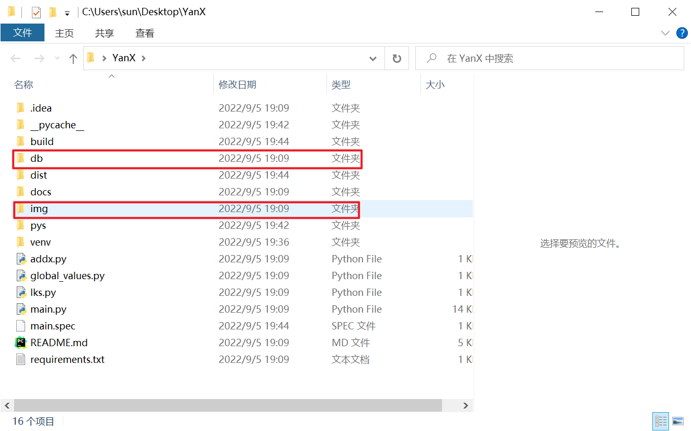

# 调试与开发

>ps：项目代码水平比较糟糕，整体更像一个缝合怪，可能并没有太大的参考价值，

## 本地调试与运行

1. 克隆项目到本地（手动下载也可）

```
git clone https://github.com/xx025/YanX.git
```

2. 进入项目目录
```text
cd YanX
```

3. 创建虚拟环境
```text
virtualenv venv
```
需提前安装virtualenv，[安装virtualenv](#安装virtualenv)

4. 激活虚拟环境(尽量使用cmd控制命令台，powershell可能有权限问题)
```
venv\Scripts\activate.bat
```

5. 安装依赖库
```
pip install -r requirements.txt
```

6. 运行
```
main.py
```

7. 打包
```
pyinstaller -F -w -i img/ico.ico main.py
```
需提前安装pyinstaller，[安装pyinstaller](#安装pyinstaller)


打包之后请手动将img和db两个文件夹复制到打包文件位置




## 附加
### 安装virtualenv
```
pip install virtualenv
```
### 安装 pyinstaller
```
pip install pyinstaller
```
